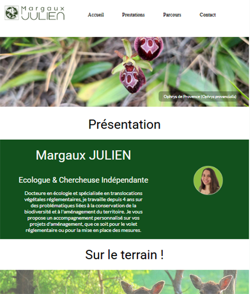
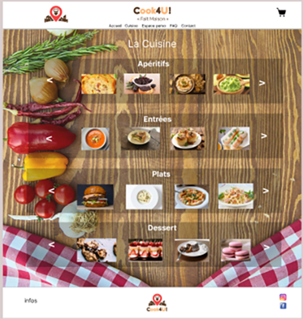
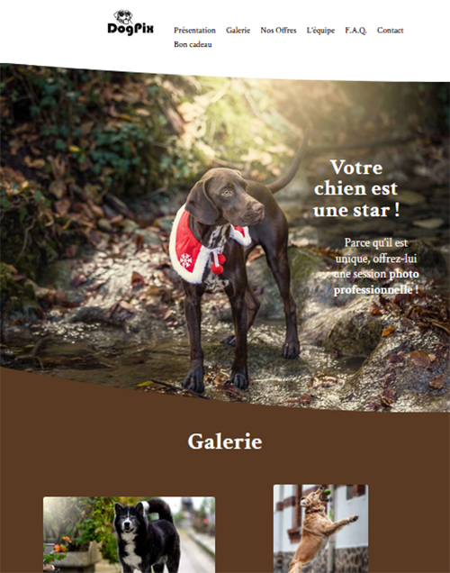

# 👨‍💻 Stéphane Vernière — Développeur Web Fullstack

Développeur spécialisé en **Angular, Node.js et MongoDB**, je conçois des applications web modernes, structurées et sécurisées.  
Ce dépôt centralise l’ensemble de mes projets visibles sur GitHub.

---

# 🌐 Projets en ligne

| Projet                  | Description                                      | Live                        |
|-------------------------|--------------------------------------------------|-----------------------------|
| **Stephaneverniere.fr** | Plateforme fullstack avec espace client sécurisé | https://stephaneverniere.fr |
| **Verniere-dev.com**     | Site vitrine développeur                         | https://verniere-dev.com     |
| **Dogpix.fr**           | Site WordPress (Divi)                            | https://dogpix.fr           |
| **Corbin-photo.fr**     | Site WordPress (Divi)                            | https://corbin-photo.fr     |

---

# 🚀 Projets techniques

---

## 📸 Stephaneverniere.fr

  

Plateforme professionnelle développée pour la gestion de galeries photos clients.

### Fonctionnalités principales

- Authentification sécurisée
- Espace client personnalisé
- Gestion de clients et galeries privées
- Stockage d’images via GridFS (MongoDB)
- Génération d’archives ZIP à la demande
- Sécurisation des accès aux ressources

### Architecture

- Angular (frontend)
- Node.js / Express (API REST)
- MongoDB
- GridFS pour stockage fichiers
- Gestion des tokens JWT
- Déploiement cloud

🔗 Code : https://github.com/PhanDev34000/stephaneverniere.fr

---

## 💻 Verniere-dev.com

  

Site vitrine développeur présentant mon parcours, mes compétences et mes projets.

### Fonctionnalités

- Présentation professionnelle
- Responsive design
- Mise en avant des projets
- Optimisation SEO basique

### Stack

- Angular
- HTML / CSS
- Responsive design

🔗 Code : https://github.com/PhanDev34000/verniere-dev

---

## 💍 Margaux Julien 

  

Site vitrine développé en PHP.

### Fonctionnalités

- Architecture PHP simple
- Responsive design
- Structure HTML / CSS organisée
- Interactions JavaScript

### Stack

- PHP
- HTML
- CSS
- JavaScript

ℹ Ce site n’est plus en ligne

🔗 Code : https://github.com/PhanDev34000/Margaux_Julien

---

# Projets pédagogiques

## 🍽 Cook4U 

  

Application PHP développée dans le cadre d’un projet de formation.

### Fonctionnalités

- Authentification utilisateur
- Gestion des utilisateurs
- Gestion de plats
- Système de commandes
- Requêtes sécurisées via PDO

### Stack

- PHP
- MySQL
- PDO
- HTML / CSS

⚠ Base de données non fournie (structure visible dans le code)

🔗 Code : https://github.com/PhanDev34000/cook4u

---

## 🎬 Cinephoria

  

Plateforme complète de réservation de cinéma développée dans le cadre de ma formation Bachelor Angular.

### Fonctionnalités principales

**Espace Administrateur**
- Gestion des villes
- Gestion des cinémas
- Gestion des salles
- Gestion des séances
- Gestion des employés
- Gestion des incidents

**Espace Utilisateur**
- Création de compte
- Authentification sécurisée (JWT)
- Réservation de séances
- Consultation et suppression de réservations
- Consultation de l’historique

**Version mobile**
- Affichage des séances à venir
- Génération d’un QR Code pour chaque billet
- Lecture QR pour validation par employé

### Architecture

- Frontend : Angular (architecture standalone)
- Backend : Node.js / Express
- Base de données : MongoDB
- Sécurité : JWT + Guards Angular
- Tests API : Jest + Supertest
- Dockerisation du projet

🔗 Code : https://github.com/PhanDev34000/cinephoria

---

# 🌐 Projets WordPress

### 🐶 Dogpix.fr

  

Site vitrine pour présenter l'activité de photographe canin.
Site WordPress réalisé avec le thème Divi.

### 📷 Corbin-photo.fr

  

Site vitrine pour présenter l'activité d'un photographe scolaire.
Site WordPress réalisé avec le thème Divi.

---

# 🛠 Compétences techniques

### Frontend
Angular • HTML • CSS • JavaScript • Responsive Design

### Backend
Node.js • Express • PHP

### Base de données
MongoDB • MySQL

### Sécurité & Architecture
JWT • Guards Angular • API REST • Gestion des rôles • Architecture modulaire

### Outils
Git • GitHub • Docker • Thunder Client • Jest • Supertest

# 📫 Contact

LinkedIn : https://www.linkedin.com/in/stephane-verniere-devmontpellier/
Email : vernierestephane@gmail.com