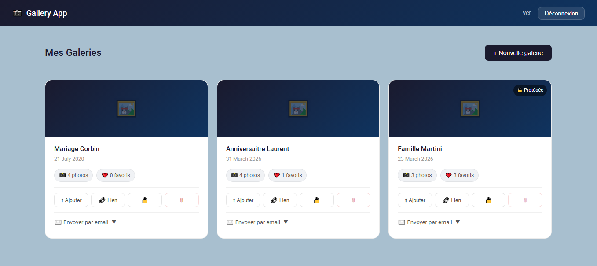
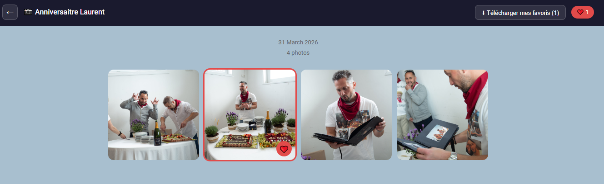
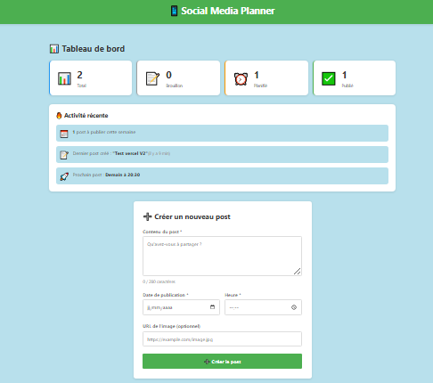
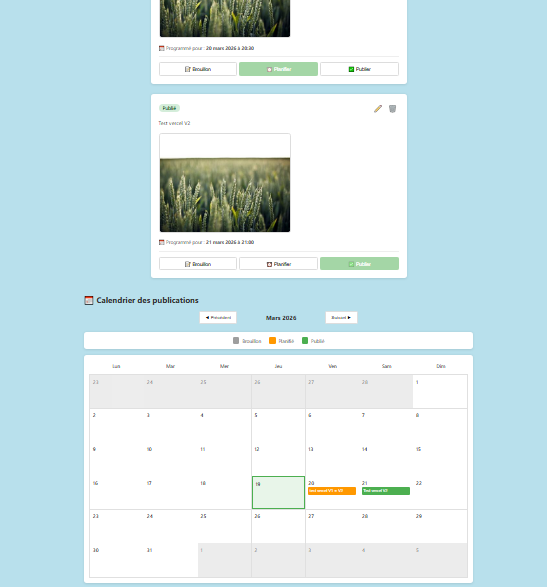

# 👨‍💻 Stéphane Vernière — Développeur Web Fullstack

Développeur spécialisé en **Angular, Node.js et MongoDB**, je conçois des applications web modernes, structurées et sécurisées.  
Ce dépôt centralise l'ensemble de mes projets visibles sur GitHub.

---

# 🌐 Projets en ligne

| Projet                  | Description                                      | Live                                |
| ----------------------- | ------------------------------------------------ | ----------------------------------- |
| **Stephaneverniere.fr** | Plateforme fullstack avec espace client sécurisé | https://stephaneverniere.fr         |
| **Verniere-dev.com**    | Site vitrine développeur                         | https://verniere-dev.com            |
| **Devis Manager**       | Gestionnaire de devis freelance (MEAN + NgRx)    | https://devis-manager-frontend.vercel.app |
| **Task Manager**        | Gestionnaire de tâches interactif (Angular)      | https://task-manager-app-ten-jet.vercel.app |
| **Social Media Planner**| Planificateur de publications réseaux sociaux (Angular) | https://social-media-planner-wine.vercel.app |
| **Galerie App**         | Application de partage de galeries photos entre photographes et clients | https://gallery-app-five-iota.vercel.app |
| **Dogpix.fr**           | Site WordPress (Divi)                            | https://dogpix.fr                   |
| **Corbin-photo.fr**     | Site WordPress (Divi)                            | https://corbin-photo.fr             |

---

# 🚀 Projets Angular

---

## 📄 Devis Manager

  
  

Gestionnaire de devis freelance complet, construit avec la stack MEAN et NgRx.

### Fonctionnalités principales

- Authentification sécurisée multi-utilisateurs (JWT)
- Gestion des clients (CRUD complet)
- Création de devis avec lignes de prestations dynamiques (FormArray)
- Calculs HT/TVA/TTC en temps réel
- Statuts de devis (brouillon, envoyé, accepté, refusé)
- Export PDF professionnel avec logo société
- Dashboard avec KPI et statistiques
- Profil utilisateur (infos société + logo)

### Architecture

- **Frontend** : Angular 19 (standalone, lazy loading, NgRx, Reactive Forms)
- **Backend** : Node.js / Express (API REST sécurisée)
- **Base de données** : MongoDB Atlas
- **Sécurité** : JWT + Guards + Intercepteurs HTTP
- **PDF** : jsPDF (génération côté client)
- **Déploiement** : Vercel (frontend) + Render (backend)

🌐 Live : https://devis-manager-frontend.vercel.app
🔗 Code Frontend : https://github.com/PhanDev34000/devis-manager-frontend
🔗 Code Backend : https://github.com/PhanDev34000/devis-manager-backend

🔐 L'inscription est libre et rapide.

---

## 📷 Gallery App

  
  

Application de partage de galeries photos entre photographes et clients.
Upload de photos, sélection de favoris, téléchargement ZIP et envoi par email.

### Fonctionnalités

- Authentification sécurisée (JWT)
- Création et gestion de galeries photos
- Upload multiple par drag & drop (jusqu'à 50 photos)
- Vue publique client via URL unique sécurisée
- Lightbox plein écran avec navigation clavier
- Système de favoris ❤️ pour sélection des photos
- Téléchargement ZIP des photos favorites
- Envoi du lien par email (EmailJS / Gmail)
- Protection optionnelle par mot de passe
- Design professionnel & sobre responsive

### Architecture

- Frontend : Angular 21 (standalone components, RxJS)
- Backend : Node.js / Express (API REST)
- Base de données : MongoDB Atlas
- Stockage photos : Cloudinary
- Emails : EmailJS
- Sécurité : JWT + Guards + Intercepteurs HTTP
- Déploiement : Vercel (frontend) + Render (backend)

🌐 Live : https://gallery-app-five-iota.vercel.app
🔗 Code Frontend : https://github.com/PhanDev34000/gallery-app
🔗 Code Backend : https://github.com/PhanDev34000/gallery-api

🔐 L'inscription est libre et rapide.

---

## 📱 Social Media Planner

  
  

Planificateur de publications pour réseaux sociaux avec calendrier visuel, système de notifications et statistiques.

### Fonctionnalités principales

- **CRUD complet** : Création, édition, suppression de posts
- **Calendrier visuel** : Vue mensuelle avec navigation et codes couleur par statut
- **Dashboard** : Statistiques temps réel (total, par statut, activité récente)
- **Notifications** : Alertes automatiques quand un post doit être publié
- **Filtres** : Par statut (Brouillon / Planifié / Publié)
- **Dark mode** : Avec sauvegarde de préférence utilisateur
- **Responsive** : Mobile, tablette, desktop

### Architecture

- **Frontend** : Angular 19 (composants standalone)
- **Services** : Architecture réactive avec RxJS (BehaviorSubject, Observables)
- **Persistance** : localStorage pour MVP rapide
- **Déploiement** : Vercel avec déploiement automatique depuis GitHub

🌐 Live : https://social-media-planner-wine.vercel.app
🔗 Code : https://github.com/PhanDev34000/Social-media-planner

---

## ✅ Task Manager

  
  

Mini SaaS de gestion de tâches type Trello, déployé en production.

### Fonctionnalités

- Authentification sécurisée (JWT)
- Gestion de tâches multi-utilisateurs
- 3 colonnes de statut : À faire / En cours / Terminé
- Drag & Drop entre colonnes (Angular CDK)
- Priorités et dates d'échéance
- Design Dark Elegant responsive (glassmorphism)
- Formulaires réactifs avec validation en temps réel

### Architecture

- Frontend : Angular 18 (standalone components, RxJS, Reactive Forms, CDK)
- Backend : Node.js / Express (API REST)
- Base de données : MongoDB Atlas
- Sécurité : JWT + Guards + Intercepteurs HTTP
- Déploiement : Vercel (frontend) + Render (backend)

🌐 Live : https://task-manager-app-ten-jet.vercel.app
🔗 Code Frontend : https://github.com/PhanDev34000/task-manager-app
🔗 Code Backend : https://github.com/PhanDev34000/task-manager-api

🔐 L'inscription est libre et rapide.

---

## 🌐 Stephaneverniere.fr

  

Plateforme professionnelle développée pour la gestion de galeries photos clients.

### Fonctionnalités principales

- Authentification sécurisée
- Espace client personnalisé
- Gestion de clients et galeries privées
- Stockage d'images via GridFS (MongoDB)
- Génération d'archives ZIP à la demande
- Sécurisation des accès aux ressources

### Architecture

- Angular (frontend)
- Node.js / Express (API REST)
- MongoDB
- GridFS pour stockage fichiers
- Gestion des tokens JWT
- Déploiement cloud

🔗 Code : https://github.com/PhanDev34000/stephaneverniere.fr

---

## 🎬 Cinephoria
> 🎓 Projet pédagogique — Bachelor Angular

  

Plateforme complète de réservation de cinéma développée dans le cadre de ma formation Bachelor Angular.

### Fonctionnalités principales

**Espace Administrateur**
- Gestion des villes, cinémas, salles, séances, employés, incidents

**Espace Utilisateur**
- Création de compte, authentification sécurisée (JWT)
- Réservation de séances
- Consultation et suppression de réservations

**Version mobile**
- Affichage des séances à venir
- Génération d'un QR Code pour chaque billet
- Lecture QR pour validation par employé

### Architecture

- Frontend : Angular (architecture standalone)
- Backend : Node.js / Express
- Base de données : MongoDB
- Sécurité : JWT + Guards Angular
- Tests API : Jest + Supertest
- Dockerisation du projet

🔗 Code : https://github.com/PhanDev34000/cinephoria

---

# 🐘 Projets PHP

---

## 💻 Verniere-dev.com

  

Site vitrine développeur présentant mon parcours, mes compétences et mes projets.

### Stack

- Angular
- HTML / CSS
- Responsive design

🔗 Code : https://github.com/PhanDev34000/verniere-dev

---

## 💍 Margaux Julien

  

Site vitrine développé en PHP.

### Stack

- PHP • HTML • CSS • JavaScript

ℹ Ce site n'est plus en ligne

🔗 Code : https://github.com/PhanDev34000/Margaux_Julien

---

## 🍽 Cook4U
> 🎓 Projet pédagogique

  

Application PHP développée dans le cadre d'un projet de formation.

### Fonctionnalités

- Authentification utilisateur
- Gestion des utilisateurs et des plats
- Système de commandes
- Requêtes sécurisées via PDO

### Stack

- PHP • MySQL • PDO • HTML / CSS

⚠ Base de données non fournie (structure visible dans le code)

🔗 Code : https://github.com/PhanDev34000/cook4u

---

# 🌐 Projets WordPress

### 🐶 Dogpix.fr

  

Site vitrine pour présenter l'activité de photographe canin.
Site WordPress réalisé avec le thème Divi.

---

### 📷 Corbin-photo.fr

  

Site vitrine pour présenter l'activité d'un photographe scolaire.
Site WordPress réalisé avec le thème Divi.

---

# 🛠 Compétences techniques

### Frontend
Angular • HTML • CSS • JavaScript • Responsive Design

### Backend
Node.js • Express • PHP

### Base de données
MongoDB • MySQL

### Sécurité & Architecture
JWT • Guards Angular • API REST • Gestion des rôles • Architecture modulaire

### Outils
Git • GitHub • Docker • Thunder Client • Jest • Supertest

---

# 📫 Contact

LinkedIn : https://www.linkedin.com/in/stephane-verniere-devmontpellier/
Email : vernierestephane@gmail.com